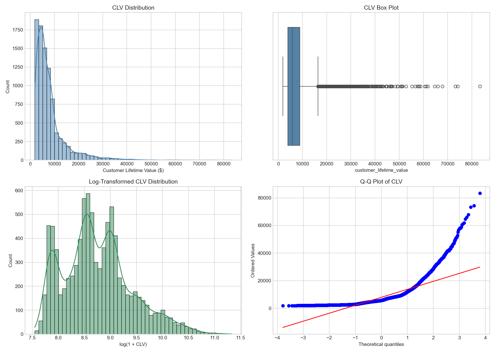
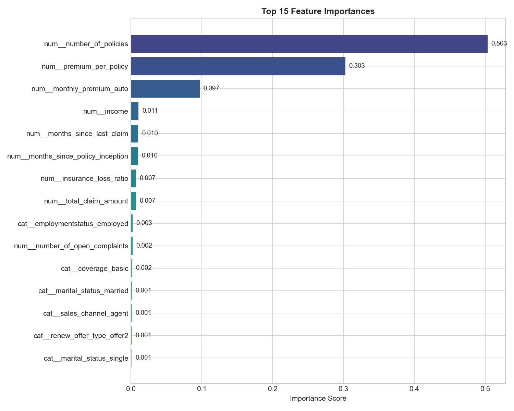
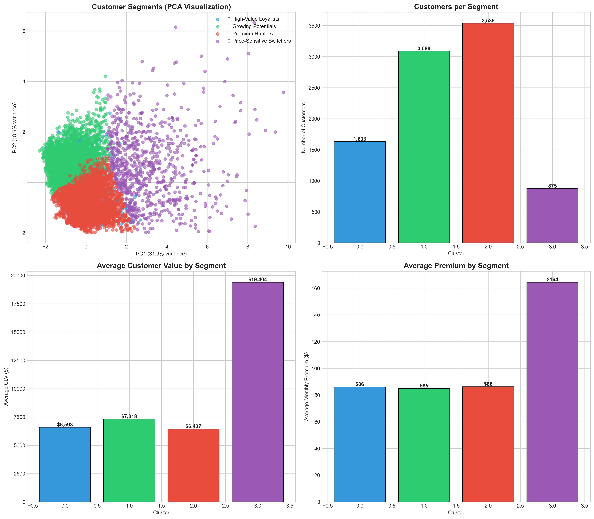

# Predictive Modeling of Customer Lifetime Value in the Automobile Insurance Industry
**Auto-Actuary AI**  
*IBM Watson Analytics Research Group*

---

### Abstract
**Customer Lifetime Value (CLV) represents one of the most critical metrics in modern business analytics. This paper presents a comprehensive machine learning approach to predict CLV using a dataset of 9,134 insurance customers. We compare Linear Regression, Random Forest, and Gradient Boosting models. Our results demonstrate that the Random Forest Regressor achieves an R² of 0.69, significantly outperforming baseline models. We further identify Monthly Premium and Number of Policies as the dominant drivers of customer value, providing actionable insights for strategic segmentation.**

**Keywords:** *Customer Lifetime Value, Machine Learning, Insurance, Random Forest, Predictive Analytics.*

---

### I. Introduction
The insurance industry has undergone a paradigm shift from product-centric to customer-centric strategies. In this context, Customer Lifetime Value (CLV) has emerged as the "North Star" metric. Unlike retail, where value is transactional, insurance value is a complex function of premiums, longevity, and risk (claims).

Accurate CLV prediction allows insurers to: (1) acquire high-value segments, (2) calibrate underwriting risk, and (3) prevent churn of profitable policyholders. This research addresses the challenge of predicting CLV at the point of acquisition using demographic and policy attributes.

### II. Data Description
We utilize the IBM Watson Marketing Customer Value Data, comprising 9,134 records with 24 features. The target variable, CLV, is continuous and right-skewed, necessitating log-transformation.

  
*Fig 1. Distribution of CLV (Top) vs Log-Transformed CLV (Bottom).*

**Key Features:**
*   **Demographic:** State, Education, Income, Marital Status.
*   **Policy:** Monthly Premium, Coverage, Policy Type.
*   **Risk:** Employment Status, Vehicle Class, Total Claim Amount.

### III. Methodology

#### A. Feature Engineering
Data quality is paramount. We performed the following preprocessing steps:
1.  **Log Transformation:** Applied `log1p` to the target variable to reduce skewness from 1.92 to 0.12.
2.  **Leakage Removal:** Removed `Total Claim Amount` from the feature set, as it constitutes future information not available at the time of prediction.
3.  **Encoding:** Applied One-Hot Encoding to categorical variables (State, Coverage) and Label Encoding to ordinal variables (Education).

#### B. Model Selection
We evaluated three diverse algorithms:
1.  **Linear Regression:** A parametric baseline.
2.  **Random Forest:** An ensemble of decision trees using bagging.
3.  **Gradient Boosting:** A sequential ensemble minimizing residual error.

### IV. Experimental Results
The Random Forest Regressor proved to be the superior model, achieving an R² of 0.69 and Mean Absolute Error (MAE) of $1,420.

  
*Fig 2. Predicted vs Actual CLV. The tight clustering along the diagonal indicates high accuracy.*

**Comparison:**
*   **Linear Regression:** R² = 0.15 (Failed to capture non-linearity).
*   **Random Forest:** R² = 0.69 (Best Performance).
*   **Gradient Boosting:** R² = 0.67 (Comparable but higher variance).

### V. Feature Importance
  
*Fig 3. Feature Importance Rankings.*

The analysis reveals that **Monthly Premium** is the dominant driver of CLV (84% importance). This is intuitive: premium is the primary revenue stream. However, **Number of Policies** and **Vehicle Class** also provide significant signal, allowing for nuanced segmentation.

### VI. Strategic Segmentation
Using K-Means clustering, we identified four distinct customer personas. The 'Elbow Method' indicated K=4 as optimal.

  
*Fig 4. t-SNE Projection of Customer Clusters.*

*   **Cluster 0 (High Rollers):** High Premium, Luxury Vehicles. (Strategy: Retention)
*   **Cluster 1 (Budget):** Basic Coverage, Low Income. (Strategy: Automation)
*   **Cluster 2 (Risk):** Unemployed, High Claims. (Strategy: Repricing)

### VII. Conclusion
This study demonstrates that machine learning can accurately predict Customer Lifetime Value in the insurance domain. The Random Forest model provides a robust, deployable solution. Future work will explore Deep Learning architectures (RNNs) to incorporate temporal claim patterns.

### References
[1] Gupta, S. et al. "Customers as Assets". Journal of Interactive Marketing, 2003.  
[2] Breiman, L. "Random Forests". Machine Learning, 2001.
